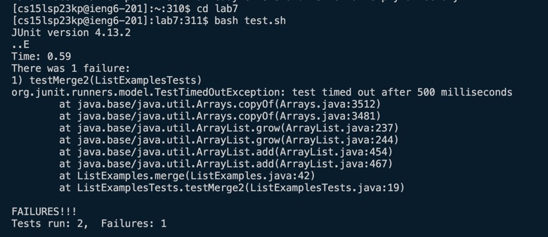

# Lab Report 4
## Khoi Nguyen
### Introduction
For the lab report this week, I will be performing the tasks listed below. For each numbered step starting right after the timer (so steps 4-9), I will be detailing exactly which keys I pressed to get to that step. Furthermore, explaining the commands I ran and what the effect of those keypresses were.  
**NOTE**: The commands and steps that I am detailing in this report will mostly be focused on steps that are starting after the timer as explained above. This includes step 4 to 9.  

### Explanation of Steps
1. **Setup**: Delete any existing forks of the repository you have on your account
2. **Setup**: Fork the repository
3. **The real deal**: Start the timer!

4. Log into ieng6  
 
<u> Commands </u>  
Username: `<up>`  
Password: `<CTRL>` + `<C>` (copied passwords from Note's app) -> `<CTRL>` + `<V>` + `<enter>`  
<u> Explanation </u>  
- Since I have previously typed in the `ssh` command, the command has already been stored in my bash history. Hence I was able to quickly type the `<up>` arrow to quickly access the command in my history.
- My account password is stored in my Note's app. Hence I was able to quickly copy (`<CTRL>` + `<C>`) and paste (`<CTRL>` + `<V>`) my password to login.

5. Clone your fork of the repository from your Github account  
 
 
<u> Commands </u>  
`<CTRL>` + `<C>` <link of github lab7) -> `git clone` +  `<CTRL>` + `<V>` + `<enter>`
<u> Explanation </u>  
- First I went to the course website to copy (`<CTRL>` + `<C>`) the link of the repository. A GitHub repository is where your project files are stored. When you clone your repository, you’re simply making a copy of the repository from GitHub and saving it to your machine. The `git clone` command copies an existing Git repository. Hence `git clone https://github.com/ucsd-cse15l-s23/lab7` clone the repository which has a subset of the code from the week 3 lab. 

6. Run the tests, demonstrating that they fail  
 
<u> Commands </u>  
`cd` + `lab7` + `bash`+ "t" + `<tab>` + `<enter>`
<u> Explanation </u>  
- First we need to make sure we are in the correct directory. The target directory is `lab7`. To change the working directory, I used the `cd` command.
- The `bash test.sh` command is used to execute a Bash shell script named "test.sh". A shell script is a file containing a series of commands that are interpreted and executed by the Bash shell. This command will help us test whether `ListExamples.java` file is successful. I first typed the letter "t" to indicate the bash shell script name starts with a letter "t". Since there is only one bash shell script name starts with a letter "t" in the working directory, the `<tab>` shortcut will auto-complete.
- In the picture above, we can clearly see since the apporiate changes were not made, the test fails.

7. Edit the code file to fix the failing test  
 
*Figure 7.1*  
 
*Figure 7.2*  
 
*Figure 7.3*  
 
*Figure 7.4*  
<u> Commands </u>  
Figure 7.1: `vim`+ "L" + `<tab>` + "." + `<tab>` + `<enter>`  
Figure 7.2: `/` + "change" + `<enter>` (cursor should be on c) -> searches for the line with the given method that needs to be edited
Figure 7.3: `<j>` + `<l>`+ `<l>`(cursor should be on 1) + `<x>` 
i<2> <escape> :wq <enter>
<u> Explanation </u>  
  
8. Run the tests, demonstrating that they now succeed  
<u> Commands </u>  
   
bash test.sh (should be good)
Up arrow, up arrow

9. Commit and push the resulting change to your Github account  
<git commit -am “name”>
git push
Enter username
Enter github password

